# ⚡️ Home Suivi Élec

  
  
  
  

---

> **Une intégration Home Assistant avancée pour détecter, scorer, piloter et visualiser toutes vos consommations électriques.**
>
> — Avec UI web moderne, APIs dynamiques et documentation complète.

---

## 🌟 Fonctionnalités clés

- 🛰️ **Détection automatique** de tous les capteurs power/energy (TP-Link, Tapo, Enedis, PowerCalc…)
- 🧬 **Scoring qualité**, gestion des doublons, préconisations
- 🎨 **Interface web moderne** configurable et multi-panneaux (React + vanilla JS, toasts, badges…)
- 🛠️ **Génération automatique de dashboards Lovelace** et exports CSV/YAML
- 🤝 **Aucune config YAML obligatoire** : tout se fait dans l’UI
- 📚 **Documentation modulaire** et maintenable dans [`docs/`](docs/)
- 🔒 **APIs, proxy sécurisé & architecture modulaire**
- 🛡️ **Supervision automatique des capteurs orphelins** : détection, purge, archivage ou report manuel en 1 clic via l’UI d’administration et REST API dédiée (nouveauté v1.0.7)

---

## 🔥 Vue globale du projet

flowchart LR
subgraph HA[Home Assist
nt] DL[detect
local.py] MS[mana
e_selection.py]
T[energy_tra
king.py] S[sensor.py]
QA[sensor_qu
lity_scorer.py] GEN[gen
rator.py]
MM[
tility_meter_manager.py]
V[validation.py]
nd subgraph "�
DL --> MS
MS --> ET
ET --> S
MS --> QA
QA --> WS
WS -->|API, proxy| PAPI
PAPI -->|REST| MS
PAPI -->|REST| QA
GEN --> WS
GEN -->|Exports| PAPI
UMM --> MS
UMM --> ET
V --> MS
V -->|flows| ET
click DL "docs/detect_local.md" "Go to detect_local"
click MS "docs/manage_selection.md"
click ET "docs/energy_tracking.md"
click S "docs/sensor.md"
click QA "docs/sensor_quality_scorer.md"
click GEN "docs/generator.md"
click UMM "docs/utility_meter_manager.md"
click V "docs/validation.md"

## 🗺️ Architecture – Vue graphique

> Ce diagramme présente tous les modules principaux et leurs flux.  
>  
> Pour modification collaborative : gardez le code source Mermaid à jour (voir `/docs/`) et regénérez ce SVG si besoin.
 Il est généré depuis le code Mermaid ci-dessous : éditez facilement le code pour toute évolution, puis regénérez le SVG via Mermaid Live Editor ou VS Code.

Cliquez pour afficher/éditer le code Mermaid source

flowchart TD
subgraph BACKEND
DL[detect_local_py]
MS[manage_selection_py]
MSV[manage_selection_views_py]
ET[energy_tracking_py]
SEN[sensor_py]
QF[sensor_quality_scorer_py]
SYNC[sensor_sync_manager_py]
SNF[sensor_name_fixer_py]
UM[utility_meter_manager_py]
VAL[validation_py]
IQ[integration_quality_fetch_py]
PM[power_monitoring_py]
OPO[options_flow_py]
CFG[config_flow_py]
PAPI[proxy_api_py]
GEN[generator_py]
PANEL[panel_selection_py]
end
subgraph FRONTEND
    INDEX[index_html ou config_html]
    WEB_STATIC[web_static]
    JS[JS modules]
    REACT[React Components]
end

subgraph HELPERS
    H_INIT[helpers_init_py]
    H_VAL[helpers_validation_py]
    H_IQ[helpers_integration_quality_fetch_py]
end

DOCS[docs_md]

DL -- "découverte sensors" --> MS
MS -- "mise à jour sélection" --> ET
MS -- "exposition sélection" --> MSV
MSV -- "API REST sensors" --> WEB_STATIC
SNF -- "correction noms" --> MS
SYNC -- "synchronisation sensors" --> MS
QF -- "scoring" --> MS
QF -- "badge UI" --> WEB_STATIC
QF -- "scoring" --> PANEL
UM -- "synchronisation utility_meter" --> ET
UM -- "management UM" --> MS
ET -- "tracking énergie" --> SEN
ET -- "exposition state" --> PAPI
PM -- "live puissance" --> ET
GEN -- "export dashboard" --> DOCS
PAPI -- "APIs REST/Proxy" --> WEB_STATIC
PANEL -- "panel UI" --> WEB_STATIC
H_INIT --> VAL
H_VAL --> VAL
H_IQ --> QF

INDEX -- "chargement UI" --> WEB_STATIC
WEB_STATIC -- "sélections, mutations" --> PAPI
PAPI -- "REST interfaces" --> MSV
JS -- "logic config/js" --> WEB_STATIC
REACT -- "panels avancés" --> WEB_STATIC
DOCS -- "documentation / aide" --> WEB_STATIC
DOCS -- "documentation / aide" --> INDEX
GEN -- "exports YAML/JSON" --> DOCS
GEN -- "exports" --> INDEX

classDef backend fill:#D6EAF8;
classDef frontend fill:#E8F8F5;
classDef helpers fill:#FEF9E7;
class BACKEND backend
class FRONTEND frontend
class HELPERS helpers

---
## 📘 Navigation IA – Choix du fichier de documentation

> **Agents IA/LLM** :  
> Pour toute tâche ou question sur l’intégration home_suivi_elec :
>
> - **Mapping global / liens API/flux / navigation inter-modules** :  
>   → [integration_mapping.md](./docs/integration_mapping.md)
> - **Questions panel/JS/UI/configuration frontend/débug** :  
>   → [frontend.md](./docs/frontend.md)
> - **Questions backend métier, modules Python, logique serveur** :  
>   → [backend.md](./docs/backend.md)
>
> Orientez l’analyse en priorité selon la catégorie de votre requête.
> (Chaque document contient liens et index vers les autres pour navigation croisée.)

---
## 📁 Sommaire documentaire & modules

> Toutes les docs techniques sont [dans /docs/](docs/)

<b>Backend & Helpers</b>

- [__init__.md](docs/__init__.md) — bootstrap intégration
- [detect_local.md](docs/detect_local.md), [manage_selection.md](docs/manage_selection.md)
- [sensor.md](docs/sensor.md), [energy_tracking.md](docs/energy_tracking.md)
- [energy_analytics.md](docs/energy_analytics.md), [energy_export.md](docs/energy_export.md)
- [sensor_quality_scorer.md](docs/sensor_quality_scorer.md)
- [utility_meter_manager.md](docs/utility_meter_manager.md)
- [validation.md](docs/validation.md), [integration_quality_fetch.md](docs/integration_quality_fetch.md)

<b>Frontend/UI</b>

- [web_static.md](docs/web_static.md) — architecture JS/React complète
- [panel_selection.md](docs/panel_selection.md), [configuration_frontend.md](docs/configuration_frontend.md)

<b>Flows, Proxies, Générateur</b>

- [config_flow.md](docs/config_flow.md), [options_flow.md](docs/options_flow.md)
- [proxy_api.md](docs/proxy_api.md)
- [generator.md](docs/generator.md)

<b>Diagnostics, Debug & Audit</b>

- [audit_energy.md](docs/audit_energy.md)
- [debug_json_sets.md](docs/debug_json_sets.md)
- [detect_local_debug_standalone.md](docs/detect_local_debug_standalone.md)

---

## 🎬 Quickstart

#### 1. Copiez `custom_components/home_suivi_elec/` dans votre dossier Home Assistant.
#### 2. Redémarrez Home Assistant.
#### 3. Ouvrez l’interface UI (Panel HSE ou `/hse` en iframe si activé).
#### 4. Sélectionnez vos capteurs et laissez HSE proposer les meilleurs.  
_Naviguez tout, exportez, gérez vos utility_meters, pilotez tout depuis l’UI ou via les APIs._

---

## 🧩 Architecture de fichiers

graph TD
A[custom_components/home_suivi_elec]
A --> B[docs/ ---> .md explicatifs]
A --> C[web_static/ ---> UI React/JS]
A --> D[helpers/ ---> utilitaires]
A --> E[core py. ---> backend logic]
B --> F[Chaque .md = 1 module]
C --> G[js/, src/]
E --> H[detect_local.py, manage_selection.py, etc.]

---

## 🔄 Matrice de flux (simplifié)

| Source             | Destination             | Type/ But                        |
|---------------------|------------------------|----------------------------------|
| detect_local.py     | manage_selection.py     | JSON Sensors découverts          |
| manage_selection.py | energy_tracking.py      | Selected sensors & mapping       |
| energy_tracking.py  | sensor.py              | Entités dynamiques HA            |
| sensor_quality_scorer.py| manage_selection   | Attributs/score entity           |
| web_static          | proxy_api/REST backend | Actions utilisateur, maj UI      |
| generator.py        | UI, Lovelace YAML      | Génération auto, download dash   |
| utility_meter_manager.py| tracking/detectors | Synchro avec utility_meter HA    |
| helpers/validation.py| flows, UI             | Validation enrichie              |
| **detect_local.py**   | **sensor_sync_manager.py** | **Repérage & suivi capteurs orphelins**|
| **sensor_sync_manager.py** | **manage_selection.py** | **Queue purge/archivage orphelins**   |
| **manage_selection.py** | **frontend_admin (JS/UI)** | **REST API actions orphelin**        |
---

🔥 Nouveautés version 1.0.7 (Octobre 2025)
------------------------------------------
> • Prise en charge complète des **capteurs orphelins** : tout sensor virtuel sans source valide est désormais automatiquement détecté, daté, marqué en attente de purge ou archivage.
> • Actions disponibles en panel admin ou via API REST : archivage, suppression ou report différé, avec synchronisation backend temps réel.
> • Nouveaux endpoints REST `/api/home_suivi_elec/orphelins` pour gestion/remontée UI, automation cron et diagnostics.

## 🏅 Points forts de l’intégration

- **Qualité** : scoring automatique visuel, badges, tri optimal
- **Sécurité** : toutes les actions critiques passent via un proxy sécurisé
- **Ergonomie** : une interface web one-click, API REST-compatible, exports dashboard/YAML/CSV
- **Extensibilité** : nouveaux capteurs, intégrations ou panels s’ajoutent via modules/JS
- **Maintenance** : chaque fichier principal possède sa doc, MAJ à chaque PR recommandée

---

## 🤝 Contribution & Bonnes pratiques

- **> Documentation obligatoire** : tout nouveau module doit avoir un .md associé dans /docs/
- **> Extensions :** suivre le modèle modulaire, chaque module = 1 responsabilité
- **> Besoin d’aide ?**  
  Consulte le guide [web_static.md](docs/web_static.md), [sensor_quality_scorer.md](docs/sensor_quality_scorer.md), etc.  
- **> Diagnostic :** voir [audit_energy.md](docs/audit_energy.md) et [debug_json_sets.md](docs/debug_json_sets.md)

---

🎯 <b>Pour toute question technique lisez la doc, puis remontez votre PR ou issue !</b> 🎯  

---
section “🔎 
Navigation debug/IA” : docs/scripts/home_suivi_elec_backend_navigation.py 
Un utilitaire CLI/AI de navigation backend est disponible dans docs/scripts/cli_backend_nav.py

_Fait pour la **stabilité**, la **performance**… et le **fun** 🧑‍💻⚡._

