🧠 Documentation du Backend – home_suivi_elec

⸻

1. Introduction générale

🎯 Objectif

Le backend de home_suivi_elec vise à :
	•	🔍 Détecter dynamiquement toutes les intégrations installées dans l’instance Home Assistant.
	•	⚡ Identifier les intégrations gérant de l’énergie (TP-Link, Tapo, Enedis, PowerCalc, utility_meter…).
	•	🔢 Récupérer et filtrer les capteurs qui mesurent la puissance ou l’énergie électrique.
	•	🧩 Enrichir ces capteurs : scoring qualité, ajout de métadonnées, normalisation et diagnostics.
	•	🪪 Créer et maintenir des entités sensors “tagguées HSE” dans Home Assistant pour un suivi optimal et centralisé.

🔁 Cycle de vie complet des capteurs
	•	Ajout automatique lors de la détection
	•	Suppression lors de la désactivation ou orphelinisation
	•	Mise en attente, archivage ou purge selon les cas (maintenance, diagnostics)

🔎 Supervision de la qualité et de la fiabilité
	•	Calcul de scores qualité
	•	Détection et gestion des doublons, capteurs orphelins, anomalies

🔗 Autres fonctionnalités
	•	Synchronisation avec les entités natives Home Assistant (utility_meter)
	•	Exposition d’API backend pour piloter toutes les actions
	•	Automatisation de la génération de dashboards et exports
	•	Sécurisation et traçabilité via un proxy backend contrôlé

⸻

🏗️ Vue d’ensemble de l’architecture
	•	Principes clés : modularité, extensibilité, robustesse
	•	Schéma du flux global : voir section 2

⸻

2. Schéma global

📈 Diagramme du flux : schema_flux_hse.svg

🧩 Description synthétique :
Ce diagramme illustre la chaîne complète depuis la détection des capteurs jusqu’à la visualisation, le scoring et les exports.

⸻

3. Modules principaux

⸻

3.1 __init__.py — Orchestrateur principal

🧠 Rôle central  
- Point d’entrée du backend : initialise tous les modules et listeners, enregistre les services HA et endpoints REST.  
- Gère la chaîne complète : détection → sélection → scoring → création/sync entités → dashboards → diagnostics → maintenance (migration/cleanup).
- Inscription du panel UI personnalisé dans la sidebar (via frontend.async_register_built_in_panel).

⚙️ Fonctionnement technique
- Setup différé asynchrone après démarrage Home Assistant (event listener EVENT_HOMEASSISTANT_STARTED).
- Enregistrement manuel des services Home Assistant :
    • `generate_local_data` → déclenche détection automatique
    • `generate_lovelace_auto` → génère dashboards Lovelace
    • `generate_selection` → génère mapping sélection
    • `reset_integration_sensor`, `migrate_cleanup` → maintenance, migration/nettoyage
    • `fix_sensor_names` → corrige automatiquement les noms de sensors
    • `copy_ui_files` → copie UI statique Lovelace
- Installe les endpoints REST natifs :
    • `/api/home_suivi_elec/set_ignored_entity` : ignore/unignore une entité
    • `/api/home_suivi_elec/choose_best_for_device` : choisit le meilleur capteur par device
    • `/api/home_suivi_elec/get_diagnostics` : diagnostic natif complet sur l'état des sensors HSE
    • endpoints `selection_view`, `score`, `panel_selection`, `proxy_api`, etc.
- Gère le fallback automatique si le setup ou la détection initiale échoue (tâche `_delayed_start` lancée en asynchrone).
- Orchestration du setup des modules critiques : energy_tracking, power_monitoring, sensor_sync_manager...
- Stockage structuré dans hass.data :
    • `hass.data[DOMAIN][“energy_sensors”]`, `sync_manager`, `options`, etc.

🔗 Interactions et dépendances
- Importe et lance : detect_local.py, generator.py, manage_selection.py, manage_selection_views.py, panel_selection.py, energy_tracking.py, migration_cleanup.py, sensor_sync_manager.py, power_monitoring.py, sensor_name_fixer.py, proxy_api.py…
- Déclenche les flows UI : config_flow.py, options_flow.py.

🔄 Cycle de vie
- Boot / reload → setup complet backend, initialisation/hydratation hass.data, fallback, listeners.
- Unload → suppression, nettoyage backend, reset des listeners/services.

🧪 Exemple
- Démarrage de HA → __init__.py enregistre services, configure panel, détecte et sélectionne les capteurs, configure tracking, expose endpoints API REST et lance diagnostics asynchrones.
- En cas d’erreur/crash sur setup, fallback automatique et logs détaillés pour monitor/debug.

---

**Debug & Repérage rapide (IA) :**
- **Fonctions principales :** `async_setup`, `async_setup_entry`, `setup_sensors_after_detection`, `_delayed_start`, panel registration.
- **Services HA enregistrés :** (voir ci-dessus, ou direct via code)
- **Endpoints REST :** listés ci-dessus, observables dans le module (via `HomeAssistantView`)
- **Clés hass.data manipulées :** `DOMAIN`, `energy_sensors`, `sync_manager`, `options`.
- **Logs et exceptions caractéristiques :** `[SETUP_ENTRY]`, `[SERVICE]`, `[INIT]`, `[RESET]`, `[MIGRATION]`, `[COPY_UI]`.
- **Pour debuguer :**
    1. Vérifie l’appel/état de chaque service HA et endpoint REST (via logs et méthodes).
    2. Inspecte hass.data (hydration à chaque setup/reload).
    3. Vérifie le panel UI côté sidebar et son état.
    4. Analyse les logs pour chaque phase du boot/setup asynchrone.
    5. Suis les exceptions/fallback signalés dans les logs du composant.

⸻

3.2 detect_local.py — Détection des capteurs power/energy
🧠 Rôle métier

Détecte automatiquement tous les capteurs “energy” et “power” présents dans l’instance Home Assistant, via analyse du registre d’entités, du registre de devices et des plateformes d’intégration.

Classe les capteurs selon leur type (physique, virtuel, helper), leur plateforme d’origine et leur fiabilité métier.

Enrichit chaque capteur avec des métadonnées détaillées : plateforme déclarée/détectée, signature physique, multi-intégration, type de référence, etc.

Annote et gère la déduplication par signature physique pour éviter les doublons.

⚙️ Fonctionnement technique

Fichier central pour la collecte et classification des sensors energy/power, exécute des groupements multi-intégration, et propose un mapping optimisé pour la suite du backend (sélection, scoring, tracking).

Filtrage intelligent selon la config, gestion des helpers, exclusions de plateformes non pertinentes.

Utilisation de priorités métier (energy physique > power physique > virtuel > helper etc.) et scoring “reliability”.

Exporte tous les résultats dans un fichier JSON (_CAPTEURS_FILE) utilisé par les modules de selection/scoring/tracking.

Version 2.10+ : détection multi-intégration complète, tagging enrichi pour UI/groupement, détection approfondie des plateformes pour chaque device physique.

🔗 Interactions et dépendances

Exécuté et appelé via le service HA run_detect_local depuis init.py.

Donne ses résultats à manage_selection.py, sensor_quality_scorer.py pour mapping/scoring.

Utilise les helpers/validation pour le contrôle de fiabilité et exclusion métiers.

Écrit les capteurs détectés dans hass.data et sur disque pour diagnostic/audit.

🔄 Cycle de vie

À chaque scan/démarrage ou sur demande (service HA/API), relance la détection et l’annotation de tous les capteurs.

Gère l’ajout/suppression/mise à jour des capteurs selon leur disponibilité, fiabilité ou changement d’intégration.

Maintient la cohérence du mapping sur le backend (mise à jour du fichier JSON et état hass.data).

🧪 Exemple

Démarrage ou service HA run_detect_local : détecte physiquement tous les capteurs energy/power, enrichit leurs métadonnées, annote les doublons, priorise et stocke pour la suite des flows backend.

Debug & Repérage rapide (IA) :

Principales fonctions métier :

__detect_from_hass(hass, config_entry), __classify_sensor(state), __classify_platform(...), __annotate_and_deduplicate(...), __get_energy_platforms_from_registry(...)

Principal point d’entrée asynchrone : async def run_detect_local(*args, **kwargs)

Service HA associé : run_detect_local (déclencheur principal pour backend/diagnostic)

Clé hass.data impactée : typiquement energy_sensors (selon setup dans init.py)

Fichier exporté : _CAPTEURS_FILE (JSON des sensors annotés pour analyse/scoring)

Exceptions/logs caractéristiques :

[DETECT] — total, physique, virtuel, helpers, multi_platform, energy/power/doublons

Logs sur exclusion, doublons, multi-integrations (info/debug)

Warnings sur les plateformes non reconnues ou entités sans device_id.

Errors sur import Home Assistant registry ou structure corrompue

Pour debuguer :

Vérifier les appels du service HA run_detect_local dans init.py et CLI si débogage

Inspecter le fichier JSON _CAPTEURS_FILE pour la liste réelle, tags, doublons et alternatives

Contrôler hass.data pour la structure en RAM (resultats/doublons/groupes)

Suivre les logs [DETECT] pour état du scan et priorités métier

Vérifier l’effet des exclusions (platforms detectés/exclus, helpers activés/désactivés)

Toujours passer par les routines principales (__detect_from_hass, __annotate_and_deduplicate) pour analyse des cycles métier

⸻

3.3 manage_selection.py — Sélection & mapping métier des capteurs
🧠 Rôle métier

Gère l’index métier enrichi des capteurs power (entity_id → infos détaillées : device, qualité, intégration, mapping, flags métier).

Applique critères métier, scoring qualité, mapping entre capteurs physiques, virtuels, helpers pour constituer la sélection backend optimale.

Permet l’enrichissement (tags, scoring, qualité intégration via fichier YAML, référence, premium…).

Exporte la sélection finale et tous les mappings vers le backend, la UI, et les autres modules métiers.

⚙️ Fonctionnement technique

Stocke l’index _CAPTEURS_INDEX (entity_id → dict enrichi) en RAM + hass.data.

Charge et sauvegarde les différents jeux de données : capteurs power JSON, sélection JSON, user_config JSON, intégration_quality YAML.

Enrichit via device_registry, entity_registry, area_registry tout capteur de l’index (zone, nom device, manufacturer, etc.).

Expose des fonctions utilitaires (async_get_capteurs_index) pour la récup et diagnostic capteurs côté init.py ou diag/REST.

Gère la classification premium/référence, tags d’exclusion ou d’alternative, flags mapping optimal.

🔗 Interactions et dépendances

Récupère en entrée le mapping capteurs depuis detect_local.py (via JSON/RAM).

Passage vers sensor_quality_scorer.py pour scoring métier et classification/doublons.

Enregistrement des vues REST et APIs (via manage_selection_views.py, async_setup_selection_api).

Échange avec user_config, options, qualité intégration.

🔄 Cycle de vie

Chargé à chaque scan/démarrage ou reload, met à jour l’index et la sélection active.

Structure en RAM et sur disque, exposée via API et diagnostic.

🧪 Exemple

Un device power, plusieurs capteurs (physiques/virtuels/helpers), manage_selection.py en fait l’index, tague le capteur optimal/référence, enrichit les métadonnées, expose la sélection pour la UI et le backend.

Debug & Repérage rapide (IA) :

Classe principale : (organisation fonctionnelle, index RAM : _CAPTEURS_INDEX)

Fonctions critiques :

_enrich_base, _enrich_device_info (pour enrichissement de l’index)

async_get_capteurs_index(hass) (point d’entrée principal pour l’index et diagnostic)

_load_json, _load_quality_map_sync (chargement datas métier, scoring)

Enregistrement API via async_setup_selection_api(hass, sync_manager)

Fichiers métier côté data :

capteurs_power.json, capteurs_selection.json, user_config.json, integration_quality.yaml

Services/API :

Index exposé par le service generate_selection (setup/init), API via manage_selection_views.py

Voir les vues REST : /api/home_suivi_elec/selection, /api/home_suivi_elec/selection_view, /api/home_suivi_elec/sync_status...

Clés hass.data manipulées :

hass.data["home_suivi_elec"]["capteurs_index"]

Logs/exceptions typiques :

Logs enrichissement device, zone, detection premium, mapping alternative/référence

Warnings sur fichiers JSON absents/corrompus, mapping impossible, zone/device missing

Pour debuguer :

Appeler async_get_capteurs_index(hass) pour obtenir l’état complet

Inspecter les JSON métiers pour index, sélection, qualité

Utiliser les endpoints REST pour diagnostic et visualisation

Vérifier les logs d’enrichissement et mapping sur panel selection/backend

⸻

3.4 sensor_quality_scorer.py — Scoring qualité & recommandation capteurs
🧠 Rôle métier

Calcule et attribue un score de qualité (quantitatif et qualitatif) à chaque capteur énergétique détecté.

Différencie capteurs physiques, virtuels et helpers pour éviter la sélection automatisée de helpers/agrégateurs.

Permet de classifier et diagnostiquer la pertinence métier de chaque sensor (EXCELLENT, BON, ACCEPTABLE, HELPER, FAIBLE).

Alimente la logique auto-sélection pour les flows backend (sélection, mapping, diagnostics).

⚙️ Fonctionnement technique

Exclusion stricte des helpers/aggrégateurs (min_max, statistics, template, utility_meter, integration, etc.) pour les calculs de coût et scoring automatique.

Fonction centrale : compute_sensor_score(sensor) : applique pondération sur l’unité de mesure, state_class, qualité intégration, type physique/virtuel, disponibilité.

Méthodes de diagnostic et enrichissement : get_sensor_recommendation_label(score), get_sensor_stars(score), enrich_sensors_with_quality(sensors).

Logique de sélection automatisée : auto_select_best_sensors(sensors) — par device_id, sépare orphelins et helpers exclus.

🔗 Interactions et dépendances

Invocable via manage_selection.py, panel_selection.py, flows backend (auto-mapping et export diagnostics).

Exposé via API backend, diagnostics, panel Lovelace.

Interagit avec les JSON/YAML métier pour l’intégration et scoring (“integration_quality”, “user_config”).

🔄 Cycle de vie

À chaque scan/reload/demande, enrichit l’ensemble des capteurs détectés ou sélectionnés avec scores, recommandations, diagnostics.

Structure enrichie exposée côté panel et diagnostic.

🧪 Exemple

Un capteur TP-Link energy physique reçoit score maximal, labellisé EXCELLENT. Un helper min_max ou template reçoit score réduit (<50), labellisé “Pour statistiques uniquement”.

La sélection backend privilégie les capteurs physiques et tague les autres comme non-recommandés/statistiques.

Debug & Repérage rapide (IA) :

Fonctions critiques :

is_physical_sensor(sensor), compute_sensor_score(sensor), get_sensor_recommendation_label(score), get_sensor_stars(score)

auto_select_best_sensors(sensors), enrich_sensors_with_quality(sensors)

Exclusions intégrations : helpers/aggrégateurs listés dans EXCLUDED_FROM_COST_CALCULATION

Logs/exceptions typiques :

Logs : [AUTO_SELECT], [HELPER], [SCORE], diagnostics par device, stats sur helpers exclus.

Warn sur intégration inconnue, capteur non physique, score faible.

Pour debuguer :

Vérifier le score attribué à chaque sensor via compute_sensor_score et logs correspondants.

Utiliser la fonction auto_select_best_sensors pour voir la sélection auto/mapping backend.

Contrôler la labellisation (get_sensor_recommendation_label) pour dashboard/diagnostics.

Confirmer l’exclusion appropriée des helpers/stats via les logs et structuration JSON/YAML métier.

Passer la liste des sensors “bruts” dans enrich_sensors_with_quality pour obtenir structure complète côté panel/API.

Vérifier toute divergence métier en croisant avec integration_quality.yaml.

⸻

3.5 sensor.py — Enregistrement et suivi entités sensor HSE
🧠 Rôle métier

Gère l’enregistrement des entités “sensor” HSE dans Home Assistant, représentant cycles d’énergie (kWh) et mesures de puissance live (W).

Fusionne les listes de sensors d’énergie (hourly, daily, weekly, monthly, yearly) et de capteurs live vers la plateforme sensor Home Assistant.

Assure que tous les sensors sélectionnés/back-end (tracking et power live) sont exposés côté UI et utilisables sur le dashboard Lovelace ou toute automatisation.

⚙️ Fonctionnement technique

Fonction centrale : async_setup_entry(hass, entry, async_add_entities)

Récupère les sensors en RAM via hass.data[DOMAIN]["energy_sensors"] (cycles) et hass.data[DOMAIN]["live_power_sensors"] (puissance temps réel).

Fusionne toutes les listes en all_sensors.

Ajoute toutes les entités via la callback Home Assistant (async_add_entities(all_sensors, True)).

Log chaque enregistrement avec le nombre de sensors énergie et power live.

Émet un warning si aucun sensor n’est disponible à l’enregistrement.

🔗 Interactions et dépendances

Appelé automatiquement par __init__.py lors du setup “sensor” de l’intégration.

Dépend des flows d’initialisation et mapping : lists construites par energy_tracking.py, manage_selection.py et phase de setup.

Expose les sensors “hse_*” pour Lovelace, UI, automatisations et export backend.

🔄 Cycle de vie

À chaque entrée/configuration/reload : mise à jour complète des sensors exposés dans Home Assistant.

S’assure que tout changement côté backend ou mapping (ajout/suppression d’un sensor ou device) est reflété dans la plateforme sensor.

🧪 Exemple

Sur un setup HSE, plusieurs sensors d’énergie (daily, monthly) et de puissance live sont listés en RAM, réunis et ajoutés d’un seul bloc côté Home Assistant.

Debug & Repérage rapide (IA) :

Fonction principale : async_setup_entry

Clés hass.data à vérifier :

hass.data[DOMAIN]["energy_sensors"]

hass.data[DOMAIN]["live_power_sensors"]

Callback HA : async_add_entities(all_sensors, True)

Logs/caractéristiques :

Enregistrement sensor : LOGGER.info("📊 SENSOR.PY: ...")

Aucun sensor : LOGGER.warning("⚠️ SENSOR.PY: Aucun sensor d'énergie à enregistrer")

Pour debuguer :

Inspecter la construction des deux listes (RAM + mapping backend).

Vérifier après chaque refresh/reload que le nombre de sensors et la nature des entités sont corrects côté frontend/HA.

Vérifier les logs d’enregistrement pour suivre la séquence (nombre et type d’entités exposées).

Contrôler que les valeurs sont bien actualisées via les cycles (tracking) ou temps réel (power live).
⸻

3.6 sensor_quality_scorer.py — Scoring qualité & diagnostic capteurs (récapitulatif IA)
🧠 Rôle métier

Évalue la qualité de chaque sensor énergétique (reliability, pertinence métier, exclusion helpers).

Attribue un score détaillé, une étiquette de recommandation, et tague les doublons/alternatifs.

Diagnostique et distingue sensors physiques (priorité), virtuels, et helpers/statistiques (exclus de la sélection).

Pilote la recommandation métier pour auto-sélection, panel UI et diagnostics internes.

⚙️ Fonctionnement technique

Fonction centrale : compute_sensor_score(sensor) (pondère multiple critères métiers, type, intégration, fiabilité).

Méthodes utilitaires :

is_physical_sensor

get_sensor_recommendation_label

get_sensor_stars

enrich_sensors_with_quality

auto_select_best_sensors (choix optimal et exclusion helpers/doublons)

Utilisation d’une constante d’exclusions pour helpers/aggrégateurs (min_max, utility_meter, integration, etc.).

🔗 Interactions et dépendances

Invocable depuis manage_selection.py, flows backend, panel_selection, UI Lovelace.

Mise à jour des diagnostics, scoring et recommandations côté panel admin, API, dashboard.

Référence les fichiers/metas métier (mapping, YAML, JSON).

🔄 Cycle de vie

Scoring et tagging à chaque scan, reload ou demande API/service HA.

Label, diagnostic et “star-rating” mis à jour et exposés dans la UI backend + Lovelace.

🧪 Exemple

Physique TP-Link : score >95, “EXCELLENT”, exclusif pour mapping > dashboard.

Helper/statistics : score <50, “À ignorer sauf pour stats”, exclus du tracking auto.

Debug & Repérage rapide (IA) :

Points d’entrée critiques :

is_physical_sensor(sensor)

compute_sensor_score(sensor)

get_sensor_recommendation_label(score)

auto_select_best_sensors(sensors)

enrich_sensors_with_quality(sensors)

Principale exclusion métier :

Liste helpers/aggrégateurs (min_max, utility_meter, template, integration, etc.) via constante interne

Logs/caractéristiques :

Tagging : [SCORE], [HELPER], [AUTO_SELECT], logs de scoring par device/physique/helper

Pour debuguer :

Tester le score via la fonction métier principale et logs (panel selection, API diagnostics)

Vérifier le mapping “best sensor” pour chaque device (fonction auto_select + label/diagnostic)

Contrôler la structure enrichie (fonction enrich_sensors_with_quality)

Consulter les logs pour détection/exclusion helpers ou tags alternatifs/doublons

⸻

3.7 generator.py — Génération automatique des dashboards Lovelace & exports YAML
🧠 Rôle métier

Génère automatiquement la configuration Lovelace basée sur l’ensemble des sensors HSE détectés/suivis.

Propose une vue d’ensemble : top 10 consommateurs, graphiques historiques, distribution d’énergie et dashboards par pièce/période.

Permet la génération/export asynchrone d’un dashboard YAML prêt à l’intégration (via l’UI ou en mode Raw Editor/YAML).

⚙️ Fonctionnement technique

Fonctions de génération vues/caractéristiques :

generate_overview_card(sensors)

generate_history_card(sensors)

generate_energy_distribution_card(sensors)

generate_gauge_card(sensor, max_value)

generate_statistic_cards(sensors)

generate_complete_dashboard(sensors)

Récupère dynamiquement tous les sensors HSE via get_all_hse_sensors(hass).

Exporte en YAML via generate_yaml_config(capteurs) et write_yaml_file(filename, content).

Point d’entrée principal : async def run_all(hass, options) qui orchestre la génération complète (dashboard + YAML).

🔗 Interactions et dépendances

Utilisé après sélection et scoring : consomme la liste des sensors issus manage_selection, tracking, scoring.

Écrit le dashboard YAML et le log dans /config/home_suivi_elec_dashboard.yaml.

Les dashboards et vues générées sont prêtes à intégrer dans l’UI Lovelace (Home Assistant) ou à personnaliser.

🔄 Cycle de vie

À chaque demande/scan/refresh, met à jour l’ensemble des vues et exports en fonction des sensors détectés.

Warning si aucun sensor HSE détecté, log complet sur la génération.

🧪 Exemple

Un appel à run_all(hass, options) génère :

Dashboard Lovelace complet (3 vues principales)

Export YAML auto-documenté prêt à être copié/collé dans l’UI ou le fichier ui-lovelace.yaml

Log détaillé du nombre de sensors inclus et des vues générées

Debug & Repérage rapide (IA) :

Fonctions clés :

run_all(hass, options) — lancement global génération/export

get_all_hse_sensors(hass)

Cartes : generate_overview_card, generate_history_card, generate_energy_distribution_card, generate_gauge_card, etc.

Export YAML : write_yaml_file

Logs/caractéristiques :

Log d’initialisation : 🧩 Lancement de la génération Lovelace Home Suivi Élec

Nombre de sensors détectés : 📊 {len(sensors)} sensors HSE détectés

Final export : ✅ Dashboard généré : {output_path}

Warning : ⚠️ Aucun sensor HSE trouvé !

Pour debuguer :

Lance la fonction principale run_all; inspecte le fichier YAML généré et les logs.

Vérifie la structure des sensors HSE récupérés (via get_all_hse_sensors).

Contrôle l’intégration du dashboard dans l’UI Lovelace (dashboard généré → Raw Editor ou ui-lovelace.yaml).

Pour chaque carte/vue, teste les paramètres sensors (top 10, mapping, cycles…).

En cas de sensors manquants, vérifie la chaîne de sélection/tracking/scoring.

⸻

3.8 helpers/validation.py — Routines de validation et contrôle d’intégrité
🧠 Rôle métier

Fournit les routines de validation centralisées pour les champs et objets métiers manipulés par le backend (“Home Suivi Élec”).

Garantit l’intégrité et la conformité des données avant stockage, exposition panel, ou exploitation backend.

⚙️ Fonctionnement technique

Utilisation de schémas Voluptuous (import vol) pour valider les formats et types utilisés dans la configuration ou les flows backend.

Validation stricte du format horaire avec une expression régulière :

Constante : HOUR_PATTERN = re.compile(r"^(?:[01]\d|2[0-3]):[0-5]\d$")

Fonction principale : validate_time(value: str) -> str
→ Vérifie toute chaîne passée au backend (définition horaire, période de consommation…)
→ Lève une exception Voluptuous si le format n’est pas valide vol.Invalid

🔗 Interactions et dépendances

Appelée dans les flows de config et d’options (config_flow.py, options_flow.py), pour sécuriser la saisie utilisateur et éviter les erreurs de structuration.

Utilisée par les modules métiers pour validation horaire ou champs critiques (tracking, export, analytics).

🔄 Cycle de vie

Appel systématique pour tout champ critique devant être validé avant sauvegarde/export/back-end.

Produit logs/erreurs pour toute saisie non valide.

🧪 Exemple

Un utilisateur renseigne “18:30” comme période de déclenchement : validate_time("18:30") accepte la valeur.

Une saisie incorrecte “27:99” : exception Voluptuous levée, le backend rejette, loge et prévient côté UI/panel.

Debug & Repérage rapide (IA) :

Fonctions clés :

validate_time(value: str) -> str

Utilisation de la constante : HOUR_PATTERN

Librairie de validation : Voluptuous (import vol)

Logs/exceptions typiques :

Exception : vol.Invalid, message "'{value}' n'est pas un format horaire valide (HH:MM)"

Pour debuguer :

Appeler la fonction sur tous les champs horaires transmis en backend/flows.

Inspecter les logs métier en cas d’erreur d’intégrité/time parsing.

Ajouter de nouvelles règles métier ou d’autres schémas Voluptuous si besoin pour valider d’autres formats.

Corriger ou reporter toute exception pour prise en compte côté config/flows et UI.

Ce module est la “barrière de conformité” pour toutes les données critiques.

⸻

3.9 energy_analytics.py — Analyse avancée, prédiction et diagnostic énergétique
🧠 Rôle métier

Réalise l’analyse détaillée des consommations énergétiques : détection d’anomalies, prédictions mensuelles, et comparaisons annuelles.

Détection automatique des consommations anormales par calcul statistique sur l’historique (écart-type, moyenne).

Génère des prédictions mensuelles (sur la base de l’historique journalier) et des comparaisons intelligentes avec les années précédentes.

⚙️ Fonctionnement technique

Détection d’anomalies :

Fonction : async def detect_consumption_anomaly(hass, sensor_id, threshold_stddev=2.0)

Récupère l’historique sur 30 jours via hass.async_add_executor_job(history.state_changes_during_period,...)

Algorithme : compare la valeur actuelle à la moyenne et l’écart-type

Signale l’anomalie si la déviation > threshold_stddev, retourne diagnostic métier/documenté

Prédiction mensuelle :

Fonction : async def predict_monthly_consumption(hass, daily_sensor_id)

Récupère l’historique du mois en cours, calcule la moyenne journalière et multiplie sur le mois entier

Retourne diagnostic et prédiction pour l’utilisateur/back-end

Comparaison annuelle :

Fonction : async def compare_yearly_consumption(hass, yearly_sensor_id)

Compare consommation actuelle à celle de l’année précédente à même date

Retourne info détaillée (différence, pourcentage, tendance, message business)

🔗 Interactions et dépendances

Utilise le module Home Assistant recorder/history pour accéder aux historiques des sensors.

Consommé par le panel selection, la UI backend, les exports analytics, ou les routines d’alerting avancées.

Appel asynchrone via service HA, API ou integration directe backend.

🔄 Cycle de vie

Appelé à chaque demande/refresh/back-end ou panel pour génération d’analyse sur demande.

Génère logs, diagnostics et messages métier pour visualisation UI et panel admin.

🧪 Exemple

detect_consumption_anomaly(hass, "sensor.energy_daily") -> signale s’il y a surconsommation ce jour vs historique.

predict_monthly_consumption(hass, "sensor.energy_daily") -> prédit la facture en fin de mois.

compare_yearly_consumption(hass, "sensor.energy_yearly") -> compare l’évolution de la consommation sur 2 ans.

Debug & Repérage rapide (IA) :

Fonctions clés :

detect_consumption_anomaly

predict_monthly_consumption

compare_yearly_consumption

Logs/caractéristiques :

Diagnostic détaillé : message retourné dans le dict (“⚠️ ANOMALIE DÉTECTÉE”, “📊 Prédiction”, “📈 Hausse/Baisse”)

Erreurs : logs [ANOMALIE], [PRÉDICTION], [COMPARAISON], exceptions remontées au backend

Pour debuguer :

Appeler les fonctions via API/service et inspecter leurs diagnostics métier (valeurs, messages, statut)

Vérifier accès aux historiques recorder/HA pour l’intégrité des données

Analyser les logs/exceptions pour traitement des sensors absents ou données corrompues

Corriger le threshold ou la période si besoin pour affiner la détection et prédiction

⸻

3.10 energy_export.py — Export, backup & intégration externe des données énergie
🧠 Rôle métier

Automatise le backup quotidien des données énergie en JSON.

Permet l’export au format CSV à la demande (pour audit, analyse ou import extranet).

Intègre nativement l’export vers InfluxDB si l’intégration Home Assistant est activée.

⚙️ Fonctionnement technique

Backup JSON :

Fonction principale : async def setup_json_backup(hass, backup_enabled=True)

Planificateur Home Assistant : backup lancé chaque jour à 00h05 via async_track_time_change

Toutes les entités contenant “_energy” sont serialisées avec leurs valeurs et attributs, dans .storage/home_suivi_elec_energy_backup.json

Export InfluxDB :

Fonction principale : async def setup_influxdb_export(hass)

Vérifie si l'intégration “influxdb” est présente dans les composants HA

Lance un callback toutes les heures pour gestion ou extension custom (export natif fait par HA)

Export CSV :

Fonction principale : async def export_to_csv(hass, sensor_ids, output_file)

Écrit un CSV horodaté des valeurs pour une liste de sensors (timestamp, sensor_id, valeur, unité)

Retourne True/False selon succès, logge le résultat

🔗 Interactions et dépendances

Appelé par init.py lors du setup, et utilisable à la demande ou via service HA/API.

Peut être couplé aux routines d’export ou de diagnostic du panel, ou utilisé pour backup externe.

Affecte le backup, la maintenance, l’audit qualité pour la version métier et partenaire.

🔄 Cycle de vie

Backup JSON planifié tous les jours.

Export InfluxDB activé automatiquement si disponible et configurable.

Export CSV sur demande ou dans la maintenance/audit.

🧪 Exemple

Lancement auto à 00h05 → backup du jour (home_suivi_elec_energy_backup.json)

Export CSV depuis backend : valeurs d’un sous-ensemble de sensors énergie.

InfluxDB gère les exports nativement, mais le module logge et peut servir pour traitements custom.

Debug & Repérage rapide (IA) :

Fonctions clés :

setup_json_backup : planification et exécution backup quotidien

setup_influxdb_export : vérification et lancement export horaire

export_to_csv : export CSV ciblé, résultat loggé

Fichiers générés :

.storage/home_suivi_elec_energy_backup.json (JSON complet)

Fichier CSV selon paramètre output_file

Logs et exceptions caractéristiques :

Backup : “✅ Backup JSON sauvegardé: {len(data['sensors'])} sensors → {backup_file}”

Export CSV : “✅ Export CSV: {len(sensor_ids)} sensors → {output_file}”

InfluxDB : “ℹ️ InfluxDB non installé, export désactivé” ou “✅ InfluxDB détecté, export horaire activé”

Erreur/exception : “❌ Erreur backup JSON: {e}”, “❌ Erreur export CSV: {e}”

Pour debuguer :

Vérifier l’horaire et la structuration du fichier JSON (backup auto, sensors energy)

Contrôler le format CSV et l’intégrité des données exportées

Inspecter la présence et la configuration de l’intégration InfluxDB dans HA

Examiner les logs pour toute exception ou erreur d’écriture

3.11 panel_selection.py — Initialisation et gestion du panneau UI statique
🧠 Rôle métier

Met en place le panneau statique “Home Suivi Élec” accessible dans la barre latérale Home Assistant.

Gère la configuration, la création et l’enregistrement automatique des fichiers statiques nécessaires à l’UI (panel.js, panel.html).

Permet l’accès à la configuration avancée, sélection, visualisation et diagnostic métier du backend via une interface dédiée.

⚙️ Fonctionnement technique

Fonction principale : async_setup_panel(hass: HomeAssistant)

Vérifie la présence du dossier panel statique, le crée si absent.

Vérifie l’existence des fichiers panel.js et panel.html, génère un HTML minimal si nécessaire.

Enregistre le répertoire comme ressource statique accessible via /home_suivi_elec.

Ajoute le panneau dans la barre latérale Home Assistant grâce à frontend.async_register_built_in_panel.

Utilise une iframe pointant vers /home_suivi_elec/panel.html avec icône dédiée (“mdi:flash”).

Stocke l’état d’enregistrement du panneau dans hass.data["home_suivi_elec_panel_registered"] pour éviter double setup.

🔗 Interactions et dépendances

Appelé par init.py lors du boot initial ou du reload backend.

Dépend du code statique frontend : panel.js et panel.html (gérés côté repo dans custom_components/home_suivi_elec/panel_static/).

Intégré avec la structure de données backend pour diagnostic, visualisation et configuration advanced via panel UI.

🔄 Cycle de vie

À chaque boot, vérifie le setup et l’enregistrement du panel sur la sidebar, évite la duplication via la marque backend.

Génère les fichiers statiques et HTML si absents, maintenance simplifiée depuis le backend (auto-repair).

🧪 Exemple

Démarrage backend :
→ Crée panel_static si besoin
→ Génère panel.html s’il manque
→ Ajoute Suivi Élec dans la barre latérale
→ Redirige vers l’UI avancée (sélection, mapping, diagnostics métiers)

Debug & Repérage rapide (IA) :

Fonction clé : async_setup_panel(hass)

Fichiers/dossiers contrôlés : \

Dossier : custom_components/home_suivi_elec/panel_static \

Fichiers : panel.js (frontend), panel.html (généré auto)

Clé hass.data associée : "home_suivi_elec_panel_registered"

Logs/exceptions typiques : \

Missing panel.js : [PANEL] Fichier panel.js introuvable : ...

Création auto HTML : [PANEL] panel.html créé automatiquement

Registration : [PANEL] ✅ Panneau Home Suivi Élec ajouté à la barre latérale

Déjà enregistré : [PANEL] ⚙️ Panneau déjà enregistré, aucune action

Pour debuguer :

Inspecter la présence/validité des fichiers panel.js et panel.html dans le dossier statique

Sur erreur de UI, vérifier les logs backend pour auto-réparation/registre

Contrôler la clé dans hass.data pour éviter double initialisation

Confirmer la présence du panneau dans la sidebar après boot/reload

3.12 sensor_name_fixer.py — Correcteur automatique des noms de sensors HSE
🧠 Rôle métier

Raccourcit et harmonise automatiquement les noms (entity_id) des sensors HSE créés par l’intégration, pour rester compatible avec Home Assistant (limite stricte de longueur).

Corrige silencieusement à la création ou sur déclenchement manuel : supprime, renomme ou génère un entity_id optimisé et lisible.

Assure l’absence de collision, doublon ou perte d’accès pour les sensors métiers (énergie, puissance…).

⚙️ Fonctionnement technique

Détecte à chaque création d’entity HSE une longueur excessive (ex : >50 caractères).

Fonction centrale de raccourcissement : _shorten_entity_name(name, max_length)

Remplace les suffixes techniques par abréviation,

Applique hashing si necessary,

Génère chaîne optimisée.

Correction asynchrone via : _fix_long_sensor_name(hass, entity_id) et routine massive : async_fix_all_long_sensors(hass)

Callback sur modification du registry d’entités (_on_entity_registry_updated) : corrige en “live” tout nouveau entity trop long dès sa création

Setup centralisé via async_setup_sensor_name_fixer(hass) appelé depuis init.py à chaque démarrage/reload

🔗 Interactions et dépendances

Relié à init.py pour activation globale ou correction massive au boot

Intégré au flow de création de sensors HSE côté backend

Utilise le registry HA (entity_registry) pour diagnostic, suppression ou renommage

🔄 Cycle de vie

Surveillance continue des créations d’entités HSE

Correction automatique lors du démarrage Home Assistant + création de sensor HSE

Suppression automatique des entités longues inutiles ou remplacées.

🧪 Exemple

Un sensor très long : sensor.hse_clim_appart1_wifi_commutateur_sur_rail_din_puissance_hourly
→ Corrigé en sensor.hse_live_cwcsrdp_h avec hashing si necessary.

Debug & Repérage rapide (IA) :

Fonctions clés :

_shorten_entity_name(name, max_length)

_fix_long_sensor_name(hass, entity_id)

async_fix_all_long_sensors(hass)

async_setup_sensor_name_fixer(hass)

Callback : _on_entity_registry_updated(hass, event)

Limite technique : MAX_ENTITY_ID_LENGTH = 50

Logs caractéristiques :

Correction : ✂️ [HSE] Nom raccourci : ...

Correction massive : 🔧 [HSE] Démarrage correction massive des noms longs...

Erreur renomme : ❌ [HSE] Erreur renommage ...

Fichier déjà corrigé : ✅ [HSE] Nom court existe déjà : ...

Warning sur impossibilité de raccourcir : ⚠️ [HSE] Impossible de calculer nom court pour : ...

Pour debuguer :

Lancer la correction massive au boot (async_fix_all_long_sensors)

Surveiller les logs pour chaque création/déclenchement/correction

Vérifier dans le registry que tous les entity_id HSE sont conformes (<50 caractères)

Tester la fonction de raccourcissement directement (cas exceptionnel/hash)

3.13 sensor_sync_manager.py — Gestionnaire de synchronisation automatique des capteurs
🧠 Rôle métier

Gère la synchronisation incrémentale et automatisée des capteurs “sensor” (ajout, suppression, indisponibilité, modification) dans le backend.

Assure la cohérence métier et la mise à jour continue du fichier capteurs_power.json à chaque changement décelé dans Home Assistant.

Automatisation du backup, gestion des états et suivi des sensors non disponibles ou en attente de suppression.

⚙️ Fonctionnement technique

Classe : SensorSyncManager

Abonné aux événements Home Assistant :

entity_registry_updated (création, suppression, modification d’entités)

state_changed (disponibilité réelle en HA)

Scan et synchronisation périodique (toutes les 5 minutes), throttling de synchronisation toutes les 30 secondes après un changement.

Backup automatique du fichier JSON avant toute modification, stockage séquentiel dans le dossier backup.

Méthodes :

_on_entity_registry_changed(event): détection et traitement des ajouts/suppressions/modifs

_on_state_changed(event): gestion du statut "unavailable"/"available"

_schedule_sync(), _process_pending_changes(), _periodic_sync(): logiques asynchrones de synchronisation

_add_sensor, _remove_sensor, _update_sensor, _mark_unavailable, _mark_available: gestion métier et cycle de vie du sensor

_cleanup_old_sensors, _backup_capteurs_file, _cleanup_old_backups: maintenance et nettoyage

get_status(): diagnostic métier backend du gestionnaire

force_sync(): relance la synchronisation totale sur demande ou erreur

🔗 Interactions et dépendances

Relié à detect_local.py pour la redétection complète lors d’ajout ou suppression de capteur.

Lecture et écriture du fichier JSON capteurs_power.json, backups gérés dans /backups/

Utilisé par init.py pour coordination globale ou diagnostic backend.

🔄 Cycle de vie

Démarrage ou reload backend : setup/init du gestionnaire, relance du scan et écoute évènements.

Synchronisation et backup à chaque changement métier (création/suppression/indisponibilité).

Nettoyage automatique des capteurs obsolètes ou trop longtemps indisponibles.

🧪 Exemple

Création d’un sensor : registry event → add → incrémental sync → backup → mise à jour du JSON

Capteur indisponible pendant 7 jours : tag, suppression programmée, backup puis suppression physique

Debug & Repérage rapide (IA) :

Classe principale : SensorSyncManager

Fonctions clés à vérifier :

start(), stop()

_on_entity_registry_changed, _on_state_changed

_schedule_sync, _process_pending_changes, _backup_capteurs_file, force_sync()

get_status()

Fichiers manipulés :

capteurs_power.json

backups dans /backups/

Logs caractéristiques :

Ajout : 📥 Nouveau sensor

Suppression : 🗑️ Sensor supprimé

Indisponibilité : ⚠️ Sensor unavailable

Backup : 💾 Backup créé

Sync périodique : 🔄 Sync périodique

Erreur synchronisation : ❌ Erreur synchronisation

Pour debuguer :

Vérifier l’enregistrement/lancement du manager au boot backend

Contrôler la cohérence du fichier JSON (structure, valeurs, statuts)

Examiner les logs sur chaque branche métier (add, remove, unavailable, available)

Inspecter la présence et la rotation des backups

Utiliser la méthode get_status() pour diagnostic côté API/backend

3.14 power_monitoring.py — Monitoring temps réel de la puissance (W)
🧠 Rôle métier

Crée et administre les sensors HSE Live pour le suivi instantané de la puissance électrique (W) dans Home Assistant.

Miroir enrichi des sensors “power” natifs : chaque entité source reçoit un “sensor.hse_live_*” synchronisé en temps réel.

Permet l’affichage sur les cartes Live Lovelace et la génération d’alertes sur consommation élevée.

⚙️ Fonctionnement technique

Classe principale : LivePowerSensor(SensorEntity)

Initialisation : entity_id en mode court (hse_live_*), nom formaté, device_class, icône, etc.

Métadonnées enrichies (zone, intégration, fiabilité, device_id…).

Miroir temps réel : mise à jour continue à chaque changement du sensor source grâce à Home Assistant event tracking.

Disponibilité automatique (“unknown”, “unavailable” → sensor indisponible).

Fonctions principales :

load_power_sensors(hass) : charge les sensors “power” à surveiller depuis capteurs_power.json.

create_live_power_sensors(hass, power_sensors) : crée les instances LivePowerSensor pour chaque capteur “power”.

async_setup_power_monitoring(hass, entry) : point d’entrée pour initialiser et charger le monitoring via hass.data.

Stockage RAM :

Les sensors live sont stockés en liste dans hass.data[DOMAIN]["live_power_sensors"], prêts à être enregistrés (via sensor.py) lors du setup.

🔗 Interactions et dépendances

Appelé par init.py lors du setup global backend.

Les sensors sont créés sur la base du fichier capteurs_power.json (généré par detect_local et sensor_sync_manager).

Exposé côté UI et dashboard Lovelace pour affichage temps réel.

🔄 Cycle de vie

À chaque scan/config/reload, génère la liste et initialise les “sensor.hse_live_*”.

Met à jour en temps réel sur chaque changement d’état du sensor source.

Gère la disponibilité et les erreurs “unknown/unavailable” automatiquement.

🧪 Exemple

Pour chaque capteur power (“sensor.tp_link_energy_appart1_power”), la classe crée “sensor.hse_live_tp_link_energy_appart1” avec mirroring direct de la puissance.

Les valeurs sont affichées en temps réel sur Lovelace (carte Gauge, history…) et permettent le suivi instantané métier.

Debug & Repérage rapide (IA) :

Classe principale : LivePowerSensor(SensorEntity)

Fonctions clés à suivre :

async_setup_power_monitoring

load_power_sensors

create_live_power_sensors

Event handler : async_track_state_change_event

Clé hass.data associée : live_power_sensors

Logs caractéristiques :

Création : 🔴 Création LivePowerSensor: {entity_id} (source: {source_entity})

Indisponibilité : ⚠️ {entity_id} → Source indisponible

Mise à jour : 🔄 {entity_id} → {state} W

Valeur invalide : ❌ {entity_id} → Valeur invalide: {state}

Initialisation : ✅ POWER MONITORING: {n} sensors temps réel créés

Pour debuguer :

Vérifier la création/mise à jour des sensors dans hass.data et le frontend (dashboard)

Contrôler les logs lors de l’ajout/création, mirroring d’état et indisponibilité

Tester les updates temps réel et la gestion des erreurs/value

Vérifier la structure JSON et la configuration backend (source, nom, device_id, etc.)

3.15 debug_json_sets.py — Outils de vérification et diagnostic JSON backend
🧠 Rôle métier

Fournit des outils de debug pour la vérification automatique des structures JSON utilisées dans le backend Home Suivi Élec.

Détecte notamment les sets ou types non convertibles dans les fichiers JSON métiers, évitant les warning/erreurs au parsing par Home Assistant.

⚙️ Fonctionnement technique

Fonction asynchrone principale : async def scan_sets(hass)

Parcourt le dossier custom_components/home_suivi_elec/data/ à la recherche de fichiers .json

Lit chaque fichier dans un thread dédié (évite le warning de blocage principal HA)

Vérifie la structure parsed : signale en log tout set ou object non sérialisable

Exception catchée et loggée automatiquement (message d'erreur + nom du fichier concerné)

Fonction utilitaire interne : _read_json_file(fichier: Path)

Ouverture sécurisée et parsing JSON, log sur erreur de lecture ou conversion

🔗 Interactions et dépendances

Appelé lors du debug général backend, ou sur demande (shell, service custom, maintenance).

Couvre tous les JSON de data/intermédiaire du backend ( sélection, mapping, index, analytics...).

🔄 Cycle de vie

À la demande, scan complet et log des datas utilisées dans le backend.

Permet diagnostic express pour maintenance, audit qualité ou vérification avant migration.

🧪 Exemple

Après refonte d’une structure ou migration, l’appel à scan_sets(hass) signale si un fichier JSON contient des objets non convertibles (ex : des sets python), pour correction immédiate avant blocage en production.

Debug & Repérage rapide (IA) :

Fonction principale à vérifier : scan_sets(hass)

Fonction utilitaire : _read_json_file(fichier: Path)

Dossier concerné : custom_components/home_suivi_elec/data/

Logs caractéristiques :

Set détecté : ⚠️ Set détecté dans {fichier}

Erreur lecture : ❌ Erreur lecture JSON {fichier} : {erreur}

Pour debuguer :

Lancer la fonction sur le backend (via shell, service, ou script)

Inspecter tous les logs pour warning de set/structuration incompatible

Corriger dans le code source ou le backend métiers toute apparition de set ou type non sérialisable

Repasser le scan pour confirmer la conformité des fichiers JSON avant update/backup ou migration

3.16 const.py — Constantes globales et dictionnaires de configuration
🧠 Rôle métier

Centralise toutes les constantes, clés, conventions de nommage et valeurs par défaut utilisées par l’intégration Home Suivi Élec.

Garantit la cohérence des intitulés, types d’abonnement, tarifs, clés d’options et chemins des fichiers backend.

⚙️ Fonctionnement technique

Définit le domaine de l’intégration : DOMAIN = "home_suivi_elec"

Déclare le chemin centralisé du fichier capteurs détectés :

FICHIER_CAPTEURS = "custom_components/home_suivi_elec/data/capteurs_detectes.json"

Liste toutes les clés métiers pour le ConfigFlow, Options, tarifs d’électricité, abonnement, périodes HC/HP/HN, etc. (ex : CONF_PRIX_HT, CONF_TYPE_CONTRAT, CONF_HC_START)

Définit les types de contrat :

CONTRATS = { "prix_unique": "Tarif unique", "heures_creuses": "Heures Pleines / Creuses" }

Précise les valeurs par défaut métier pour chaque type de contrat, abonnement mensuel, plages horaires HC, prix HP/HC...

🔗 Interactions et dépendances

Importé par tous les modules critiques du backend (detect_local, manage_selection, config_flow, options_flow, generator, tracking...).

Utilisé pour initialiser, valider et manipuler les données de config/utilisateur dans les flows et UI.

🔄 Cycle de vie

Chargé à chaque setup ou import backend.

Utilisé à la création, configuration, validation et génération de tous les objets métiers.

🧪 Exemple

Génération d’un sensor énergie : utilise les clés et valeurs métier de const.py pour renseigner son nom, period et tarifs associés.

Création ou validation d’une nouvelle config : utilise les clés ConfigFlow/options et les valeurs par défaut métiers.

Debug & Repérage rapide (IA) :

Clés métiers principales :

DOMAIN, FICHIER_CAPTEURS

Tarifs/utilisateurs : CONF_PRIX_HT, CONF_PRIX_TTC, CONF_ABONNEMENT_MENSUEL_HT, etc.

Contrats : CONTRATS, plages horaires HC/HP

Valeurs par défaut : DEFAULTS

Pour debuguer :

Vérifier en cas de bug sur une clé ou un libellé si celle-ci est bien définie dans const.py

Contrôler le chemin métier et valeurs par défaut pour tout problème sur la configuration ou l’initialisation d’un sensor

Maintenir const.py au centre du cycle métier (ne jamais dupliquer une constante hors de ce fichier)

Corriger ou enrichir via ce fichier toute nouvelle clé métier ou option UI/flow/diagnostic backend

3.17 config_flow.py — Flux de configuration Home Assistant (UI setup, tarifs, options)
🧠 Rôle métier

Gère le flux de configuration principal lors de l’ajout/installation de l’intégration “Home Suivi Élec” dans Home Assistant.

Permet à l’utilisateur de définir le nom du hub, le type de contrat d’électricité, les tarifs et options avancées par le biais de formulaires interactifs UI.

Centralise la gestion des doublons, validation et création des entrées de configuration dans Home Assistant.

⚙️ Fonctionnement technique

Classe principale : HomeSuiviElecFlow(config_entries.ConfigFlow)

Flux utilisateur :

async_step_user(self, user_input=None) : formulaire premier niveau pour nom, type de contrat, auto_generate, avec validation et détection doublon (abort "hub_exists")

async_step_tarifs(self, user_input=None) : formulaire suivant selon type de contrat (tarif unique ou heures creuses), avec valeurs métier et validation (schema spécifique)

Validation de float positif, valeurs par défaut, plages horaires via Voluptuous et config_validation

Création d'une nouvelle entrée avec titre et data consolidée, stockée en RAM et accessible à l’intégration

Liaison options : méthode statique async_get_options_flow, retourne le flow avancé (modification à posteriori via Options UI)

🔗 Interactions et dépendances

Utilise les constantes/dictionnaires métier de const.py (DOMAIN, CONTRATS, DEFAULTS, etc.)

Liaison à options_flow.py pour la gestion avancée (modification ultérieure)

Appelé automatiquement lors de l’installation ou de la configuration dans HA UI

🔄 Cycle de vie

À chaque installation ou ajout de l’intégration : setup initial guidé par formulaire

À chaque modification : options_flow associé pour changement des paramètres

🧪 Exemple

Utilisateur installe “Home Suivi Élec” :
→ Saisie du nom du hub, choix contrat, tarifs, horaires
→ Validation doublon et structure métier
→ Création de l’entrée et activation du backend

Debug & Repérage rapide (IA) :

Classe principale : HomeSuiviElecFlow

Étapes/fonctions clés :

async_step_user

async_step_tarifs

async_get_options_flow

Validation métier :

Voluptuous, config_validation (types, valeurs limites, horaires HC/HP)

Contrats et valeurs par défaut via DEFAULTS/CONTRATS (const.py)

Gestion de la détection de doublon (abort via hub_exists)

Logs/caractéristiques :

Création : [CONFIG_FLOW] Entry created: {title}

Validation/abort : [CONFIG_FLOW] Hub exists abort

Erreur : [CONFIG_FLOW] Erreur sur valeur ou type

Pour debuguer :

Tester chaque étape du flow UI (user/tarifs) et valider la data créée

Vérifier le mapping avec const.py pour toute requête de contrat ou tarif

Inspecter abort et gestion des doublons à chaque ajout

Lier les modifications à options_flow pour extension métier

3.18 options_flow.py — Options avancées, modification et personnalisation UI
🧠 Rôle métier

Permet à l’utilisateur de modifier les paramètres de l’intégration “Home Suivi Élec” après installation, directement depuis l’UI Home Assistant.

Offre une interface avancée pour ajuster le contrat, tarifs, plages horaires, options d’auto-génération et d’abonnement, sans réinstaller.

Garantit la cohérence métier et la validation des entrées lors de chaque modification.

⚙️ Fonctionnement technique

Classe principale : HomeSuiviElecOptionsFlow(config_entries.OptionsFlow)

Fonction principale : async_step_init(self, user_input=None)

Charge les valeurs courantes ou les defaults métiers depuis DEFAULTS/const.py

Affiche tous les champs du config_flow, selon le contrat sélectionné (unique ou HC/HP)

Valide les données saisies via Voluptuous et config_validation (float positif, string, bool, choix métier)

Crée une nouvelle entrée d’options dans Home Assistant (stockée base, accessible à l’intégration)

🔗 Interactions et dépendances

Relié directement à config_flow.py (appel via async_get_options_flow)

Utilise toutes les constantes métiers définies dans const.py (tarifs, types, options clés)

Permet la modification dynamique sans restart via panel UI

🔄 Cycle de vie

Appelé à chaque modification utilisateur (menu Options, ou settings dans Home Assistant)

Permet la reconfiguration métier à la volée : contrats, tarifs, plages horaires, options avancées

Valide et sauvegarde chaque modification (impact backend direct)

🧪 Exemple

L’utilisateur change le tarif HC à 0.11 : formulaire dynamique → validation → sauvegarde entry → backend mis à jour.

Debug & Repérage rapide (IA) :

Classe principale : HomeSuiviElecOptionsFlow

Fonction clé à suivre :

async_step_init

Validation métier :

Voluptuous, config_validation, listes métiers de const.py (contrats, prix, horaires)

Fusion de defaults et valeurs utilisateur

Logs/caractéristiques :

Modification : [OPTIONS_FLOW] Options modifiées: {data}

Validation : [OPTIONS_FLOW] Erreur saisie: {champ}

Entry créée : [OPTIONS_FLOW] Entry created

Pour debuguer :

Tester la modification des champs dans l’UI Options, valider la sauvegarde

Vérifier correspondance avec DEFAULTS, CONTRATS et clés métiers de const.py

Inspecter logs backend sur chaque modification et validation métiers

Corriger tout problème de validation ou affichage via Voluptuous/schema

3.19 proxy_api.py — Proxy API frontend-backend, gestion sécurité et authentification
🧠 Rôle métier

Fait office de proxy entre les requêtes frontend (UI, panel) et les API backend métiers.

Permet de centraliser et sécuriser les appels depuis le panel ou la UI vers le backend, sans exposer directement tous les endpoints.

Peut contourner temporairement l’authentification Home Assistant pour certains endpoints (optionnelle via requires_auth).

⚙️ Fonctionnement technique

Classe principale : SuiviElecProxyView(HomeAssistantView)

URL du proxy : /api/home_suivi_elec/proxy

Nom de la route : api:home_suivi_elec:proxy

Authentification : requires_auth = False (modifiable si besoin)

CORS : cors_allowed = True pour accès cross-UI

Méthode : async def post(self, request)

Récupère le payload JSON, lit “endpoint” et “method”

Construit l’URL cible à partir du frontend

Lance la requête HTTP asynchrone via aiohttp.ClientSession()

Retourne la réponse brute (json ou texte selon type), status HTTP

Logge toutes les tentatives et erreurs proxy

Message d’erreur si endpoint non transmis ou exception rencontrée

🔗 Interactions et dépendances

Appelé par la UI frontend, panel_selection, ou toute interface JS personnalisée.

Centralise tous les appels du frontend pour sécuriser, monitorer et loguer l’accès aux APIs backend.

Relié à la route proxy /api/home_suivi_elec/proxy— n’expose pas les vrais endpoints backend en direct.

🔄 Cycle de vie

Initialisé au boot/reload dans le backend (via init.py ou directement par le panel)

Intercepte toutes les requêtes panel/frontend nécessitant accès backend

🧪 Exemple

L’UI frontend fait un POST /api/home_suivi_elec/proxy avec payload { "endpoint": "/api/home_suivi_elec/get_diagnostics" } → le proxy transfère vers l’API backend, retourne la réponse sécurisée (auth facultative).

Debug & Repérage rapide (IA) :

Classe principale : SuiviElecProxyView

Fonction clé à surveiller : post(self, request)

URL proxy exposée : /api/home_suivi_elec/proxy

Logs caractéristiques :

Appel : [PROXY] METHOD ENDPOINT

Erreur requête : [PROXY] Erreur: ...

Endpoint requis manquant : { "error": "endpoint requis" }

Retour JSON/texte selon la réponse cible

Pour debuguer :

Vérifier la construction du payload envoyé par la UI/panel frontend

Examiner le log backend pour chaque appel ou erreur

Tester différents endpoints backend via le proxy (requête HTTP simulateur/JS)

Contrôler la gestion du CORS et de l’authentification selon besoin

Remonter toute exception ou configuration incorrecte via logs et status HTTP

4. Flows et interactions

🔄 Cycle de vie des données

flowchart TD
    DETECT[detect_local.py 🔎 Détection]
    SELECTION[manage_selection.py 🎯 Sélection / Mapping]
    SCORER[sensor_quality_scorer.py 🏅 Scoring / Diagnostic]
    TRACKING[energy_tracking.py 📈 Suivi / Historique]
    ANALYTICS[energy_analytics.py 🧮 Analyse / Prédictions]
    EXPORT[energy_export.py 🚚 Export / Backup]
    SENSOR[sensor.py 🪪 Entités HSE]
    GENERATOR[generator.py 🖼️ Dashboards]
    VALIDATION[helpers/validation.py ✅ Validation]

    DETECT --> SELECTION
    SELECTION --> SCORER
    SCORER --> SELECTION
    SELECTION --> TRACKING
    TRACKING --> GENERATOR
    TRACKING --> ANALYTICS
    TRACKING --> EXPORT
    GENERATOR --> SENSOR
    GENERATOR --> EXPORT
    ANALYTICS --> GENERATOR
    SENSOR --> VALIDATION
    DETECT --> VALIDATION
    SCORER --> VALIDATION
    TRACKING --> VALIDATION

🖼️ Illustration :

## **5. Autres scripts backend**

| Fichier | Rôle |
|----------|------|
| `migration_cleanup.py` | Gère la migration des anciennes entités et le nettoyage des entités obsolètes lors d’une mise à jour. |
| `detect_local_debug_standalone.py` / `detect_energy.py` | Outils utilitaires de test et de débogage : permettent d’exécuter la détection locale hors du contexte Home Assistant. |

## 🔗 Table de correspondance Besoin métier / Service / API / Module / Fichier

| Besoin métier                         | Service HA / Action           | Module (Fichier)                  | Endpoint REST                           |
|---------------------------------------|-------------------------------|------------------------------------|-----------------------------------------|
| Détection des capteurs                | run_detect_local              | detect_local.py                    | /api/home_suivi_elec/detect             |
| Sélection & mapping                   | generate_selection, update_selection, reset_selection | manage_selection.py         | /api/home_suivi_elec/selection          |
| Gestion des vues sélection            | selection_view, auto_select   | manage_selection_views.py           | /api/home_suivi_elec/selection_view     |
| Scoring qualité capteurs              | score_sensors                 | sensor_quality_scorer.py            | /api/home_suivi_elec/score              |
| Suivi énergétique                     | track_energy, sync_tracker    | energy_tracking.py                  | /api/home_suivi_elec/track              |
| Analyse avancée (diagnostic/prédiction)| analytics_run, compare_years  | energy_analytics.py                 | /api/home_suivi_elec/analytics          |
| Export, backup énergétique            | export_energy, backup_energy  | energy_export.py                    | /api/home_suivi_elec/export             |
| Génération Lovelace/dashboard         | generate_dashboard, export_lovelace | generator.py                  | /api/home_suivi_elec/generate           |
| Gestion entités sensors HSE           | create_sensor, update_sensor, delete_sensor | sensor.py                  | /api/home_suivi_elec/sensor             |
| Validation & diagnostic backend       | validate_data, diagnostic_run | helpers/validation.py               | /api/home_suivi_elec/validate           |
| Migration & nettoyage backend         | migration_cleanup             | migration_cleanup.py                | /api/home_suivi_elec/cleanup            |
| Debug sets & parsing JSON             | scan_sets, debug_json         | debug_json_sets.py                  | /api/home_suivi_elec/debug_sets         |
| Correction nom capteur                | fix_sensor_names              | sensor_name_fixer.py                | /api/home_suivi_elec/fix_names          |
| Panel UI, gestion sélection           | panel_selection               | panel_selection.py                  | /api/home_suivi_elec/panel_selection    |
| Synchronisation backend               | sync_sensors                  | sensor_sync_manager.py              | /api/home_suivi_elec/sync               |
| Monitor & analyse power temps réel    | monitor_power, real_time      | power_monitoring.py                 | /api/home_suivi_elec/power_monitor      |
| Proxy API (sécurité, accès externe)   | proxy_api                     | proxy_api.py                        | /api/home_suivi_elec/proxy              |

## 🗄️ Table de mapping hass.data : clés, objets et modules

| Clé dans hass.data                 | Objet stocké / Description                         | Source/Module associé           |
|------------------------------------|----------------------------------------------------|---------------------------------|
| DATA_HSE_MANAGER                   | Instance manager global HSE, cœur de l’intégration | __init__.py, manage_selection.py|
| DATA_DETECTED_DEVICES              | Liste des devices/capteurs détectés                | detect_local.py                 |
| DATA_SELECTED_SENSORS              | Liste des capteurs sélectionnés                    | manage_selection.py             |
| DATA_TRACKERS                      | Objets trackers énergétiques (par périodicité)     | energy_tracking.py              |
| DATA_SCORE_CACHE                   | Cache des scores qualité pour chaque capteur       | sensor_quality_scorer.py        |
| DATA_ANALYTICS_RESULTS             | Stockage analyses avancées et diagnostics          | energy_analytics.py             |
| DATA_BACKUP                        | Données backup/export énergétique                  | energy_export.py                |
| DATA_PANEL_SELECTION               | État et historique sélection côté panel UI         | panel_selection.py              |
| DATA_SYNC_MANAGER                  | Statut synchronisation sensors/entities            | sensor_sync_manager.py          |
| DATA_MIGRATION_STATUS              | Statut et logs de migration/cleanup                | migration_cleanup.py            |
| DATA_JSON_SETS_DEBUG               | Sets JSON en debug, logs parsing                   | debug_json_sets.py              |
| DATA_FIX_NAMES_LOGS                | Logs et corrections noms capteurs                  | sensor_name_fixer.py            |
| DATA_CONST                         | Constantes globales partagées                      | const.py                        |
| DATA_OPTIONS                       | Options utilisateur/config avancée                 | config_flow.py, options_flow.py |
| DATA_POWER_MONITOR                 | Statut monitoring power temps réel                 | power_monitoring.py             |
| DATA_PROXY_API_STATUS              | Statut proxy backend, endpoints externes           | proxy_api.py                    |

flowchart TD

    subgraph Services/API
      SDetect["run_detect_local\n/api/detect"]
      SSelect["generate_selection\n/api/selection"]
      SScore["score_sensors\n/api/score"]
      STrack["track_energy\n/api/track"]
      SAnalytics["analytics_run\n/api/analytics"]
      SExport["export_energy\n/api/export"]
      SPanel["panel_selection\n/api/panel_selection"]
      SSync["sync_sensors\n/api/sync"]
      SMigrate["migration_cleanup\n/api/cleanup"]
      SDebug["scan_sets\n/api/debug_sets"]
      SFix["fix_sensor_names\n/api/fix_names"]
      SPowerMonitor["monitor_power\n/api/power_monitor"]
      SProxy["proxy_api\n/api/proxy"]
    end

    subgraph Modules Backend
      Detect[detect_local.py]
      Select[manage_selection.py]
      Views[manage_selection_views.py]
      Score[sensor_quality_scorer.py]
      Track[energy_tracking.py]
      Analytics[energy_analytics.py]
      Export[energy_export.py]
      Gen[generator.py]
      Sensor[sensor.py]
      Panel[panel_selection.py]
      Sync[sensor_sync_manager.py]
      Migrate[migration_cleanup.py]
      Debug[debug_json_sets.py]
      Fix[sensor_name_fixer.py]
      PM["power_monitoring.py"]
      Proxy[proxy_api.py]
      Const[const.py]
      Options["config_flow.py\noptions_flow.py"]
    end

    subgraph hass.data
      DManager[DATA_HSE_MANAGER]
      DDevices[DATA_DETECTED_DEVICES]
      DSelected[DATA_SELECTED_SENSORS]
      DTrackers[DATA_TRACKERS]
      DScore[DATA_SCORE_CACHE]
      DAnalytics[DATA_ANALYTICS_RESULTS]
      DBackup[DATA_BACKUP]
      DPanel[DATA_PANEL_SELECTION]
      DSync[DATA_SYNC_MANAGER]
      DMigrate[DATA_MIGRATION_STATUS]
      DDebug[DATA_JSON_SETS_DEBUG]
      DFix[DATA_FIX_NAMES_LOGS]
      DConst[DATA_CONST]
      DOptions[DATA_OPTIONS]
      DPower[DATA_POWER_MONITOR]
      DProxy[DATA_PROXY_API_STATUS]
    end

    %% Services vers Modules
    SDetect --> Detect
    SSelect --> Select
    SScore --> Score
    STrack --> Track
    SAnalytics --> Analytics
    SExport --> Export
    SPanel --> Panel
    SSync --> Sync
    SMigrate --> Migrate
    SDebug --> Debug
    SFix --> Fix
    SPowerMonitor --> PM
    SProxy --> Proxy

    %% Modules vers hass.data
    Detect --> DDevices
    Select --> DSelected
    Track --> DTrackers
    Score --> DScore
    Analytics --> DAnalytics
    Export --> DBackup
    Panel --> DPanel
    Sync --> DSync
    Migrate --> DMigrate
    Debug --> DDebug
    Fix --> DFix
    Gen --> DSelected
    Sensor --> DSelected
    Const --> DConst
    Options --> DOptions
    PM --> DPower
    Proxy --> DProxy
    Views --> DPanel

6. API et endpoints
	•	📡 Liste complète des endpoints REST exposés
	•	⚙️ Paramètres, payloads et exemples d’usage
	•	🔐 Sécurité et authentification (proxy API, HASS tokens)

⸻

7. Erreurs, logs et diagnostic
	•	🧾 Politique de gestion d’erreurs et exceptions
	•	📁 Emplacement des logs backend
	•	🧰 Outils de diagnostic et audit

⸻

8. Exemples d’usage
	•	Scénarios typiques : détection, scoring, administration
	•	Exemples d’appels API et extraits de code

⸻

9. Extension et maintenance
	•	📚 Guidelines pour étendre le backend
	•	🔧 Points d’entrée modifiables
	•	♻️ Compatibilité ascendante garantie

⸻

10. Ressources associées
	•	Liens vers chaque fichier source
	•	Diagrammes techniques et documentation complémentaire

